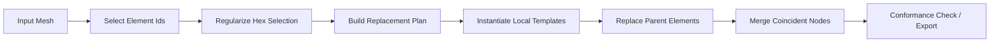
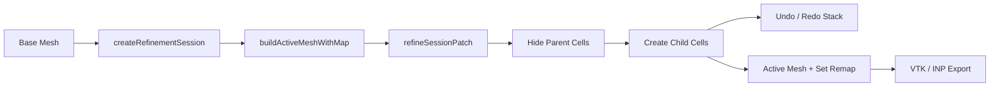

# ComformHex Architecture

ComformHex is organized as a small TypeScript mesh-refinement library plus a
browser workbench. The runtime entry is `src/index.ts`, which re-exports the
kernel, refinement, session, replay, and export APIs.

## Goals

- Keep the mesh kernel independent from UI code.
- Keep refinement logic deterministic and testable from Node.
- Preserve enough hierarchy to support undo/redo, command replay, and named set
  remapping.
- Export flat conforming meshes for downstream tools.

## Layer Map

```txt
Browser workbench
  examples/browser/refinement-gui.html
  examples/browser/refinement-worker.js

Public API
  src/index.ts

Workflow APIs
  src/refinement-ops.ts
  src/hex-core.ts
  src/refinement-session.ts
  src/command-script.ts
  src/export.ts

Planning and algorithms
  src/refinement-planner.ts
  src/transitions.ts
  src/regularization.ts
  src/session-regularization.ts
  src/conformance.ts

Mesh kernel
  src/types.ts
  src/grid.ts
  src/mesh.ts
  src/topology.ts
  src/templates.ts
  src/mesh-selection.ts
  src/distance.ts
  src/vector.ts
```

## Data Model

The core data shape is `Mesh`:

```ts
interface Mesh {
  nodes: Point[];
  elements: Element[];
  kind?: "Q1" | "H1";
}
```

Nodes are stored in normal JavaScript array order. Element connectivity uses
1-based node ids. This mirrors legacy notebook data and INP-style files, and it
keeps exported connectivity easy to inspect.

`Q1` elements are four-node quads. `H1` elements are eight-node hexes. Most
functions infer `kind` from the first element when `mesh.kind` is missing.

## Refinement Flow

Flat refinement follows this path:



The replacement plan classifies each parent as:

- `selected`: the user-selected refinement core.
- `face-transition`: a hex face transition template.
- `edge-transition`: a Q1 edge transition or hex edge transition template.
- `corner-transition`: a Q1 corner transition template.
- `unchanged`: existing cells copied into the output mesh.

## Session Flow

`RefinementSession` keeps a hierarchy of cells instead of immediately discarding
parent/child relationships. This is the path used by the browser workbench:



The active mesh is a flat view of active leaf cells. The build result also
contains maps between active element ids, session cell ids, output node ids, and
session node ids. Those maps are what make named cell/node sets stable across
export.

## Browser Workbench

The GUI is intentionally a thin client around the same runtime modules:

- `refinement-gui.html` imports `../../dist/index.js`.
- `refinement-worker.js` imports `../../dist/index.js` and handles heavier
  conformance/export work off the UI thread.
- The GUI records command scripts that can be replayed through
  `replayComformHexCommandScript`.

The browser path does not use any project-external source code.

## Build Artifacts

`npm run build` compiles `src/**/*.ts` into `dist/`. Browser examples and tests
import the generated `dist/index.js`, so a build step is required before runtime
tests or manual browser use.
